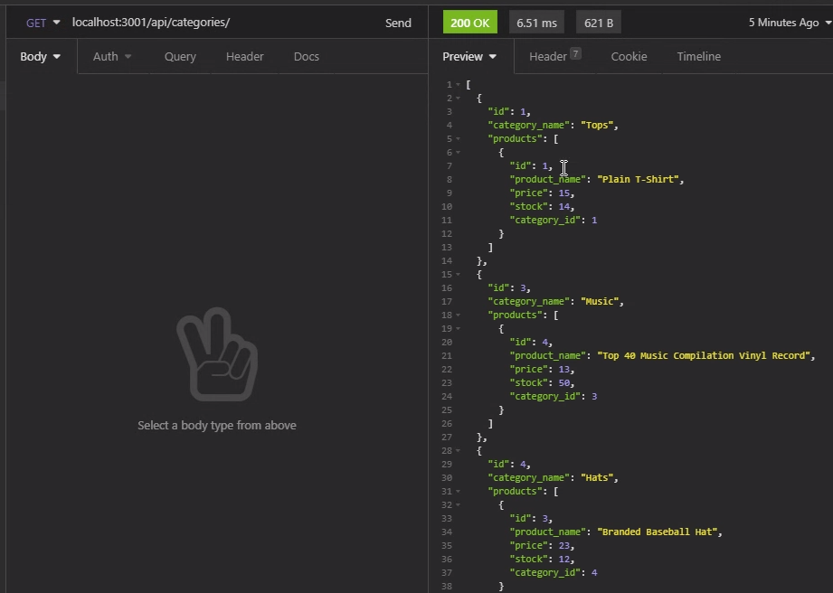
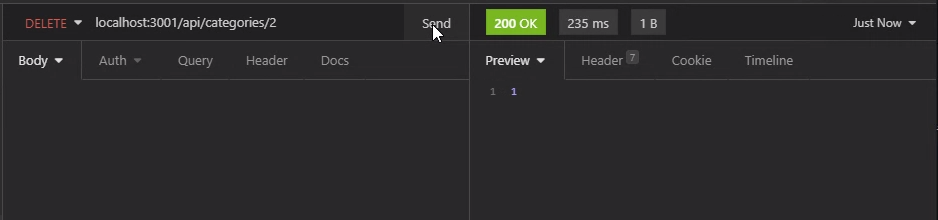
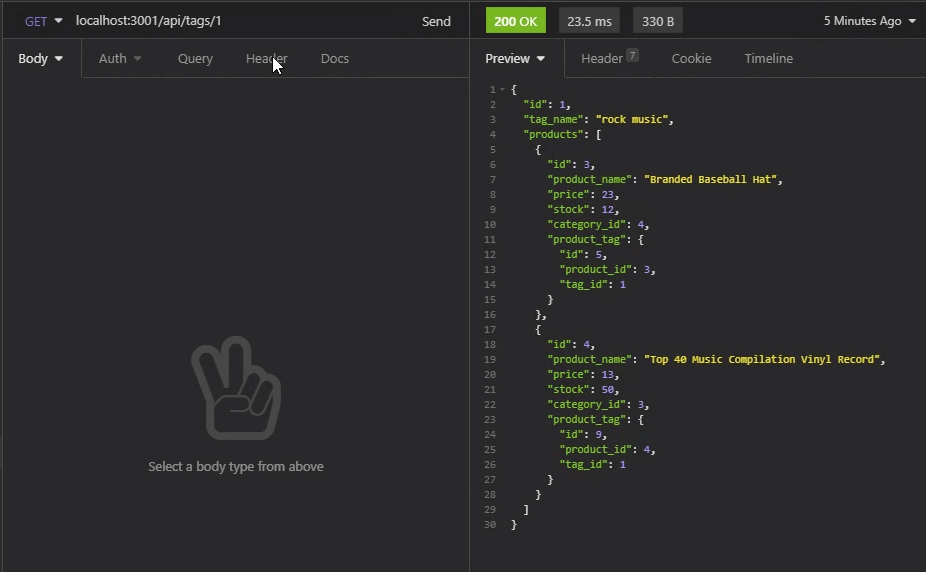

# E-Commerce

## Description
  
A simple database meant to add upload, view, and delete product in an online store.

## Table of Contents (Optional)
- [Installation](#installation)
- [Usage](#usage)

## Installation
1) Install NPM 
2) Install Nodemon 
3) Install mysql 
4) Install Sequelize 
5) Set up the database 
6) Run the seeds 
7) Open the Insomnia program, or whatever similar program you prefer to use 

## Usage
Included are screenshots of the program. 

Enter the command 'node server.js' and use Insomnia to explore the different commands as showcased in the linked video below.

[How to Use the Program](https://drive.google.com/file/d/1Gyff3jV8TDjSZeRj3Yd4SgS22xDcczQl/view?usp=sharing)

